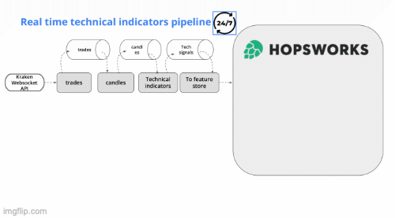

# Real Time ML System - Predict Crypto Currency

This project has been build in the [@Pau Labarto](https://es.linkedin.com/in/pau-labarta-bajo-4432074b/en) course. Where we learn how to build an E2E ML system with streaming data.

## What is this project about?

We build and deploy a real time ML system that predicts short-term crypto prices. We build from scratch, step by step, covering the entire ML system development process.

#### Generic Tooling

- [uv](https://github.com/astral-sh/uv) to package our services code.
- - [pyproject.toml](https://docs.astral.sh/uv/guides/projects/#pyprojecttoml)
- - [.venv](https://docs.astral.sh/uv/guides/projects/#venv)
- - [uv.lock](https://docs.astral.sh/uv/guides/projects/#uvlock)
- [ruff](https://docs.astral.sh/ruff/) as a formater and checker.
- [pre-commit](https://pre-commit.com/) to run our formater and checker before any push.
- [Makefile](https://en.wikipedia.org/wiki/Make_(software)) easy shortcut to most used commands.
- [Docker](https://www.docker.com/products/docker-desktop/) standard containerization software.

#### Cloud Services

- [Redpanda](): local Kafka.
- [CometML](https://www.comet.com/site/): model registry as well as experiment tracking.
- [Hopsworks](https://www.hopsworks.ai): Feature store.
- [QuixCloud](https://quix.io/quix-cloud): deployment?
- [HuggingFace](https://huggingface.co): LLM model registry.

# Technical Details

This project follows a microservice architecture that is base on 3 main components FTI pipeline:
- Feature
- Training
- Inference

## Feature

There are two feature pipelines that will feed our model:
1. Technical indicators pipeline: gather data from [Kraken API](https://docs.kraken.com/api/) -> calculate technical indicators -> upload to [Feature Store](https://www.hopsworks.ai).
1. News signals pipeline: get news from [Cryptopanic](https://cryptopanic.com) API -> LLM classify -> upload to [Feature Store](https://www.hopsworks.ai).

### Feature - Technical Indicators

