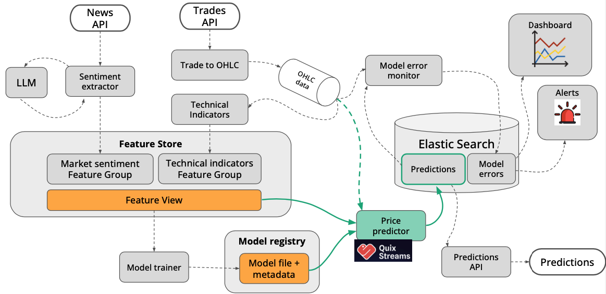

# Real Time ML System - Predict Crypto Currency

This project has been build in the [@Pau Labarto](https://es.linkedin.com/in/pau-labarta-bajo-4432074b/en) course. Where we learned how to build an E2E ML system with streaming data.


## What is this project about?

We build and deploy a real time ML system that predicts short-term crypto prices. We build from scratch, step by step, covering the entire ML system development process.


#### Generic Tooling

- [uv](https://github.com/astral-sh/uv) to package our services code.
- - [pyproject.toml](https://docs.astral.sh/uv/guides/projects/#pyprojecttoml)
- - [.venv](https://docs.astral.sh/uv/guides/projects/#venv)
- - [uv.lock](https://docs.astral.sh/uv/guides/projects/#uvlock)
- [ruff](https://docs.astral.sh/ruff/) as a formater and checker.
- [pre-commit](https://pre-commit.com/) to run our formater and checker before any push.
- [Makefile](https://en.wikipedia.org/wiki/Make_(software)) easy shortcut to most used commands.
- [Docker](https://www.docker.com/products/docker-desktop/) standard containerization software.


#### Cloud and Local Services

- [Redpanda](https://www.redpanda.com): Local Kafka. Find a docker compose to run it here: `docker-compose/redpanda.yaml`.
- [ElastiSearch](https://www.elastic.co/elasticsearch): Database to store our predictions and take advantatge of [Kibana](https://www.elastic.co/kibana) to visualize it. Find a docker compose to run it here: `docker-compose/elasticsearch.yaml`.
- [CometML](https://www.comet.com/site/): Model registry as well as experiment tracking.
- [Hopsworks](https://www.hopsworks.ai): Feature store.
- [QuixCloud](https://quix.io/quix-cloud): Deployment?
- [HuggingFace](https://huggingface.co): LLM model registry.
- [Ollama](https://ollama.com): To inference our finetuned LLM.


## Quick Start

### Set up

Python services are packaged with [uv](https://github.com/astral-sh/uv) and Rust with [cargo](https://doc.rust-lang.org/cargo/). You can easily set up any python service either with `uv` or use the `Dockerfile`.

* uv:
```bash
uv sync
```

* cargo:

```bash
cargo run
```


# Technical Details - Overview

This project follows a microservice architecture that is base on 3 main components, the FTI pipeline:
- Feature
- Training
- Inference


<center>
    
</center>


## Features

There are two feature pipelines that will feed our model:
1. Technical indicators pipeline: gather data from [Kraken API](https://docs.kraken.com/api/) -> calculate technical indicators -> upload to [Feature Store](https://www.hopsworks.ai).
1. News signals pipeline: get news from [Cryptopanic](https://cryptopanic.com) API -> LLM classify -> upload to [Feature Store](https://www.hopsworks.ai).

Each feature has two pipelines: **historical** and **live** data. Even though the origin could be from different endpoints (for instance, technical indicators have a REST API for historical data and a websocket for live data), we use the same pipeline to feed the features to the feature store. By doing this, we ensure that our data has no discrepancies between historical and live data (this is really important when it comes to training the model).


### Feature - Technical Indicators

Spin up locally this feature pipeline using `docker-compose/technical-indicators-live.yaml` or `docker-compose/technical-indicators-historical.yaml`, this pipeline has 4 steps:
1. [Trades](services/trades/README.md): Get trades data from Kraken API.
1. [Candles](services/candles/README.md): Calculate candles for a given windows.
1. [Technical Indicators](services/technical-indicators/README.md): Calculate technical indicators from the candles service.
1. [To Feature Store](services/to-feature-store/README.md): Upload technical indicators to the Feature Store.

<center>
    
</center>


### Feature - News Signals

Spin up locally this feature pipeline using `docker-compose/news-signal-historical.yaml` or `docker-compose/news-signal-historical.yaml`, this pipeline has 3 steps:
1. [News](services/news/README.md) Polls the [Cryptopanic](https://cryptopanic.com) REST API for news and removes duplicate values. Pushes them to a Kafka topi
    * In case `data_source`=**live** polls news from Cryptopanic REST API.
    * `data_source`=**historical** gets the news from CSV file from *https://github.com/soheilrahsaz/cryptoNewsDataset/raw/refs/heads/main/CryptoNewsDataset_csvOutput.rar*.
1. [News Signals](services/news-signal/README.md) Calls LLM to get the signals of news.
1. [To Feature Store](services/to-feature-store/README.md): Upload news signals to the Feature Store.

<center>
    
</center>
<center>
    
</center>

Note: the [news-signal](services/news-signal/README.md) has also a **Training** script to finetune the open source LLM. You can find all the code here: `services/news-signal/finetune_src`.


## Training

Once all feature pipelines are ready, we can proceed to the training pipeline. This project utilizes two models:
* **LLM (LLama 3.2 1b)**: to extract signal from news pipeline.
* **XGBoost**: to predict crypto currency price.

### LLM (Llama 3.2 1b)

To finetune our own LLM first we need to have generated historical news data with his corresponding signal, this is done using the `news` and `news-signal` pipeline. The dataset has this structure:

```json
{
  "instruction": "\nYou are an expert crypto financial analyst with deep knowledge of market dynamics and sentiment analysis.\nAnalyze the following news story and determine its potential impact on crypto asset prices.\nFocus on both direct mentions and indirect implications for each asset.\n\nDo not output data for a given coin if the news is not relevant to it.\n\n## Example input news story\n\"Goldman Sachs wants to invest in Bitcoin and Ethereum, but not in XRP\"\n\n## Example output\n[\n    {\"coin\": \"BTC\", \"signal\": 1},\n    {\"coin\": \"ETH\", \"signal\": 1},\n    {\"coin\": \"XRP\", \"signal\": -1},\n]\n",
  "input": "Fantom Foundation awards $1.7M bounty for preventing $170M drain",
  "output": "{\"news_signals\":[{\"coin\":\"ETH\",\"signal\":1},{\"coin\":\"SOL\",\"signal\":1}]}",
  "teacher_model_name": "claude-3-5-sonnet-20241022"
}
```
You can find a ready generted dataset here: `services/news-signal/data/instruction_dataset_ollama_11k.jsonl`.

We have choose Llama 3.2 1b LLM to finetune, as it's a tinny LLM but enough strong to accomplish our task. You can find a script to finetune your own LLM here: `services/news-signal/finetune_src/fine_tuning.py`
First you will need 3 things:
1. **A GPU**: if you are a gpu poor as I am, you can use serverless providers such as: [Lambda](https://lambdalabs.com/?srsltid=AfmBOoqWtAJut4mVEd3kuNlAtQnRrURsZFU-9oXme9moDxfuM7ee__18), [TogetherAI](https://www.together.ai), [Scaleway](https://www.scaleway.com/en/gpu-instances-signup/?utm_source=google&utm_medium=cpc&utm_campaign=ai-ml-solution-eu-prio&utm_term=ai-ml-gpu&utm_content=gpu-instances-signup&gad_source=1&gbraid=0AAAAAC10KOQZQ4pj3Rv_nbWvY6JeDBMoN&gclid=EAIaIQobChMIlbCuj-ztiwMVuYKDBx0G0Q_nEAAYAiAAEgKGGPD_BwE) and more. In my case, I choose Lambda because they offer cost-effective instances and easy SSH connections. Fine-tuning a small LLM (1-8B parameters) on a 10K dataset costs less than $5 (approximately). You can use an A10 or A100 GPU, and you'll be good to go.
1. **[HuggingFace](https://huggingface.co)** account: to download and upload your model we will use huggingface as it has a free tier and it works really well. You can set your token as `HF_TOKEN`.
1. **[CometML](https://www.comet.com/site/)** account: we use it as exeriment tracker and model regestry. You can set your token as `COMET_API_KEY`.

Once you have all set up in `news-signals` you can run:

```bash
uv run finetune_src/fine_tuning.py \
    --base_llm_name unsloth/Llama-3.2-1B-bnb-4bit \
    --dataset_path ./data/instruction_dataset_ollama_11k.jsonl \
    --comet_ml_project_name news-signal-extractor \
    --max_steps 100
```

or simple run: ```make fine-tune```


### XGBoost

To train our price prediction model, we will use [XGBoost](https://xgboost.readthedocs.io/en/stable/), a widely used machine learning model for tabular data. First of all we need have our features in the Feature Store in the right format:

<center>
    
</center>

Note: joinned news-signal and technical-indicators features in the Feature Store using a feature view (native feature of Feature Stores). You can see this implementation in detail here: `services/price-predictor/src/feature_reader.py`.


Once you have all the features ready and available in the feature view, you can proceed to train your model (make sure to set your Comet token again). You can train your model on your device's hardware without a GPU.

To establish a baseline for comparison, we evaluate our model's performance against a naive model called DummyModel. This allows us to determine whether our model is improving upon the simplest possible solution. For more details, refer to the training script: `services/price-predictor/src/training/training.py.`

To run the price predictor service training:

- On your local machine: `uv run python training.py`
- Within the Docker container: `make run-training`


### Inference

The inference pipeline has two services involved:
- `price-predictor`: predict the live data in our feature store and upload it to `elasticsearch`.
- `prediction-api`: get the predictions from `elasticsearch` and serve to the user with our Rust REST API.


### Prediction API - Rust

Our REST API to serve our predictions is in [Rust](https://www.rust-lang.org), a fast and memory-efficient language.

The REST API has two endpoint:
- health
- predict: takes as argument the **pair** of cryptocurrency to predict.


## Architecture

The services follow a streaming architecture pattern where:

Data is ingested from multiple sources (trades, news)
Processed through various transformations (candles, technical analysis)
Features are generated for downstream machine learning tasks
Each service is independently deployable and scalable, communicating through the message bus for resilience and decoupling
